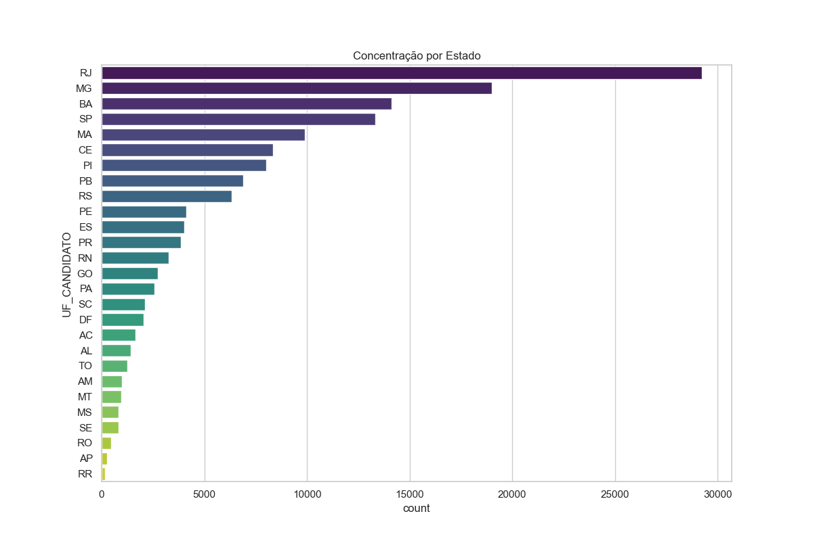
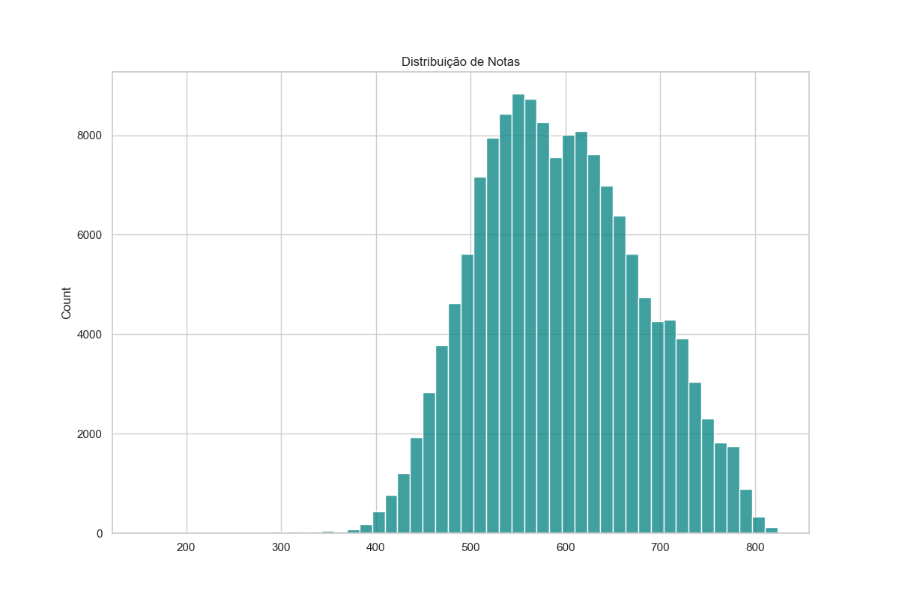
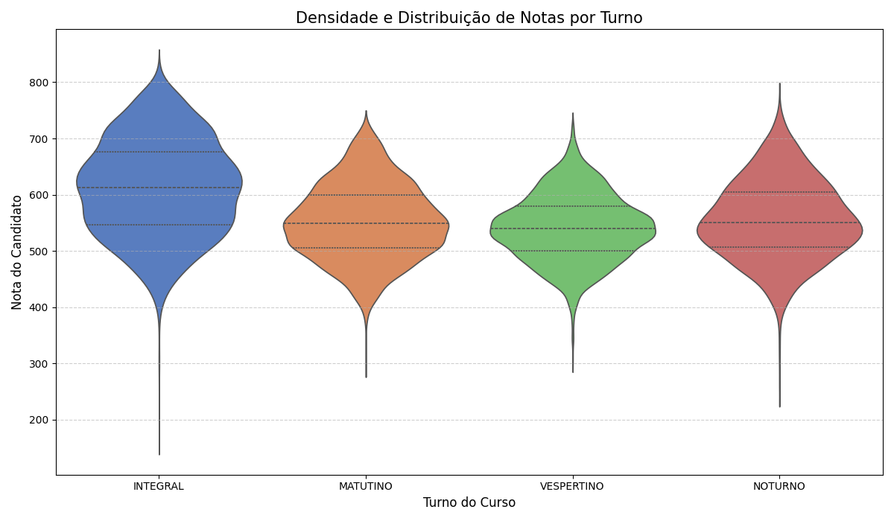
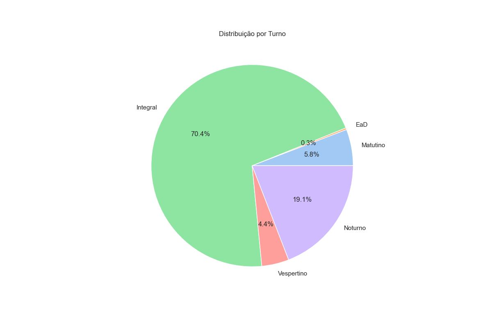
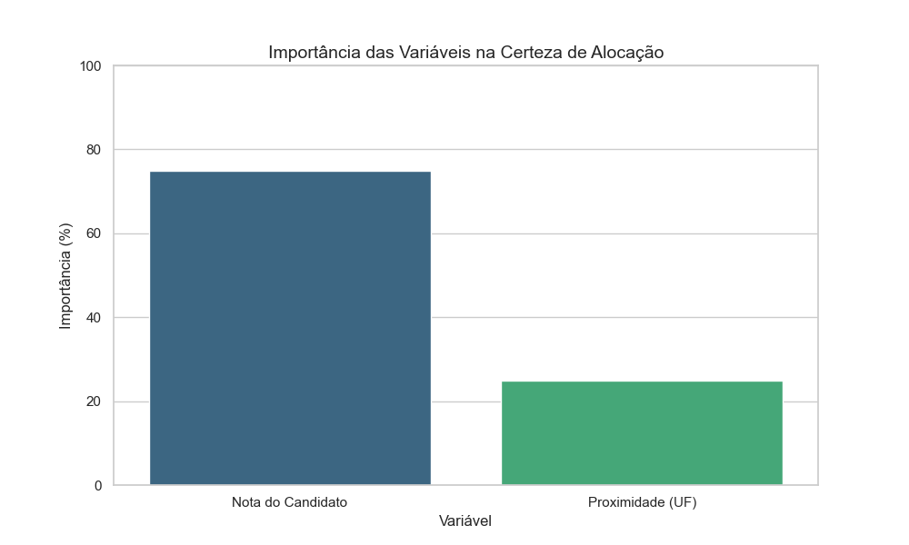
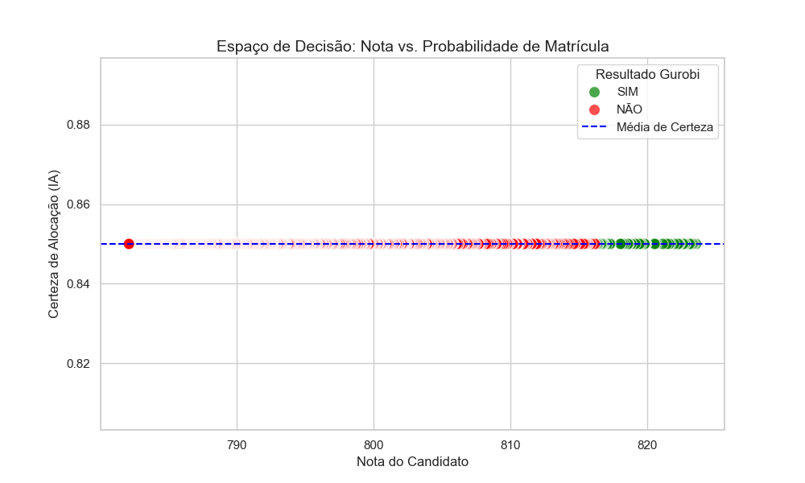

Este repositório contém o toolkit desenvolvido para o meu TCC em **Sistemas de Informação**. O projeto utiliza **Machine Learning** para prever a probabilidade de matrícula e **Pesquisa Operacional** (Gurobi/Julia) para maximizar o preenchimento de vagas públicas, reduzindo a ociosidade.

## Arquitetura do Sistema
A integração entre o processamento de dados e o motor de otimização segue o fluxo abaixo:

Resultados da Análise de Dados
Utilizamos o motor **Polars** em Python para processar massivamente os dados do SISU 2023.2, explorando 100% da capacidade multicore da CPU.

### 1. Perfil dos Candidatos e Notas
Abaixo, a distribuição geográfica dos candidatos e a análise de densidade das notas, fundamentais para entender a competitividade.

| Distribuição por Região | Distribuição de Notas |
|:---:|:---:|
|  |  |

### 2. Comportamento e Turnos
Análise de como as notas se comportam entre diferentes turnos e modalidades de cota, utilizando gráficos de Violino para visualizar a densidade.

| Notas por Turno (Violino) | Distribuição por Turno (Pizza) |
|:---:|:---:|
|  |  |

### 3. Inteligência do Modelo e Otimização
Aqui vemos o "cérebro" do projeto: a importância que a IA deu para cada variável e o **Mapa de Certeza**, que cruza Nota vs. Probabilidade para a tomada de decisão do Gurobi.

| Pesos da IA | Mapa de Certeza |
|:---:|:---:|
|  |  |

## Tecnologias e Ferramentas
- **Linguagens:** Julia (Otimização) e Python (Data Science).
- **Solver:** Gurobi Optimizer.
- **Processamento:** Polars (Paralelismo Multicore).
- **Visualização:** Seaborn e Matplotlib.

## Estrutura de Arquivos
- `analise.jl`: Algoritmo principal de otimização estocástica.
- `plotar.py`: Script otimizado para geração de gráficos em larga escala.
- `Artigos/`: Referencial teórico utilizado no projeto.
- `notebooks/*.ipynb`: Testes de filtragem e exploração inicial.

Desenvolvido por **Tailan de Souza** como parte do Trabalho de Conclusão do Curso em Sistemas de Informação.
