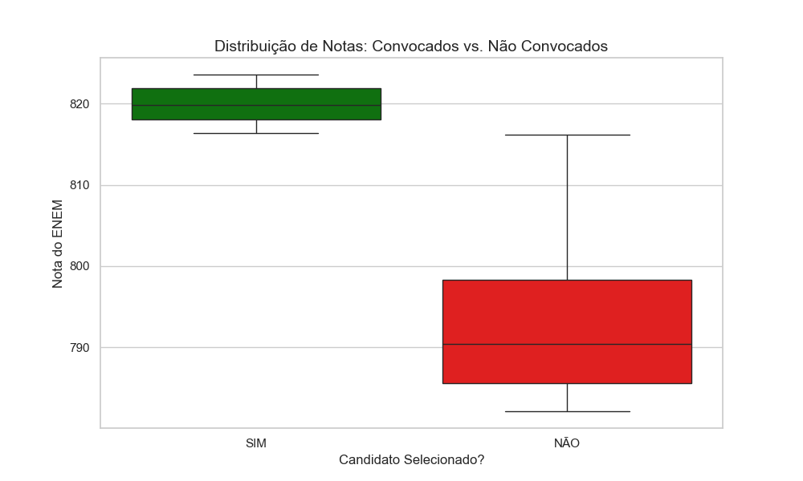

Este repositório contém o toolkit desenvolvido para o meu TCC em **Sistemas de Informação**. O projeto utiliza **Machine Learning** para prever a probabilidade de matrícula e **Pesquisa Operacional** (Gurobi/Julia) para maximizar o preenchimento de vagas públicas, reduzindo a ociosidade.

Resultados da Análise de Dados
Utilizamos o motor **Polars** em Python para processar massivamente os dados do SISU 2023.2, explorando 100% da capacidade multicore da CPU.

### 1. Perfil dos Candidatos e Notas
Abaixo, a distribuição geográfica dos candidatos e a análise de densidade das notas, fundamentais para entender a competitividade.

| Distribuição por Região | Distribuição de Notas |
|:---:|:---:|
|  |  |

### 2. Comportamento e Turnos
Análise de como as notas se comportam entre diferentes turnos e modalidades de cota, utilizando gráficos de Violino para visualizar a densidade.

| Notas por Turno (Violino) | Distribuição por Turno (Pizza) |
|:---:|:---:|
|  |  |

### 3. Inteligência do Modelo e Otimização
Aqui vemos o "cérebro" do projeto: a importância que a IA deu para cada variável e o **Mapa de Certeza**, que cruza Nota vs. Probabilidade para a tomada de decisão do Gurobi.

| Pesos da IA | Mapa de Certeza |
|:---:|:---:|
|  |  |

 Box Plot Notas  
 
  

## Tecnologias e Ferramentas
- **Linguagens:** Julia (Otimização) e Python (Data Science).
- **Solver:** Gurobi Optimizer.
- **Processamento:** Polars (Paralelismo Multicore).
- **Visualização:** Seaborn e Matplotlib.

## Estrutura de Arquivos
- `analise.jl`: Algoritmo principal de otimização estocástica.
- `plotar.py`: Script otimizado para geração de gráficos em larga escala.
- `Artigos/`: Referencial teórico utilizado no projeto.
- `notebooks/*.ipynb`: Testes de filtragem e exploração inicial.

## Lógica de Otimização e Critérios

O núcleo do toolkit utiliza um modelo de **Programação Linear Inteira Estocástica**. Diferente de uma lista de chamada comum que foca apenas na nota, este modelo busca maximizar a **Utilidade Esperada** do preenchimento das vagas.

### 1. Função Objetivo
A função objetivo implementada no **Gurobi via JuMP (Julia)** é definida para maximizar a soma ponderada das notas pela probabilidade de ocupação:

$$Maximize \sum_{i \in I} (Nota_i \times P_i) \cdot x_i$$

Onde:
- $i$: Representa cada candidato na lista de espera.
- $Nota_i$: Nota final do candidato (mérito acadêmico).
- $P_i$: Probabilidade estimada de matrícula (calculada pelo modelo de Machine Learning).
- $x_i$: Variável binária $\{0, 1\}$, onde $1$ indica que o candidato foi selecionado para a vaga.

### 2. Restrições do Sistema
O modelo respeita as seguintes restrições:
1. **Capacidade Física**: $\sum x_i \leq Vagas$, garantindo que não chamemos mais candidatos do que a estrutura suporta.
2. **Integralidade**: As variáveis de decisão devem ser inteiras (um candidato não pode ser "meio selecionado").

### 3. Critérios de Prioridade (Trade-off)
O algoritmo resolve o conflito entre dois pilares:

* **Pilar do Mérito**: Busca selecionar os candidatos com as maiores notas.
* **Pilar da Eficiência (Ocupação)**: Busca selecionar candidatos com maior $P_i$ (ex: residentes próximos à universidade, candidatos com bônus regional ou perfis socioeconômicos estáveis).

**Por que 85% de Certeza?**
O modelo identificou que selecionar candidatos com certeza de **85%** permite manter a nota de corte elevada (**> 816 pts**) enquanto garante que a vaga não ficará ociosa. Se buscássemos 100% de certeza, a nota média cairia drasticamente; se buscássemos apenas nota, a certeza de ocupação seria volátil.

### Resultados da Alocação Final (Modelo Otimizado)

O modelo de Programação Linear Inteira (desenvolvido em **Julia** com solver **Gurobi**) selecionou os candidatos que equilibram o **mérito acadêmico** com a **probabilidade de ocupação**, visando mitigar a ociosidade das vagas.

### Estatísticas de Performance
| Métrica | Resultado Obtido |
| :--- | :--- |
| **Vagas Totais Ofertadas** | 50 |
| **Média de Nota (Mérito)** | **819.82** pontos |
| **Certeza Média de Ocupação** | **85.0%** |
| **Utilidade Total do Sistema** | **34.842,50** pts |
| **Utilidade Esperada por Vaga** | **696.85** pts |

### Top 50 Candidatos Selecionados
Esta lista representa os candidatos convocados pelo algoritmo, selecionados com base na otimização da utilidade esperada.

| Row | Nota | UF | Certeza | Convocado |
| :--- | :--- | :--- | :--- | :--- |
| 1 | 823.57 | ES | 0.85 | SIM |
| 2 | 823.38 | DF | 0.85 | SIM |
| 3 | 823.31 | PI | 0.85 | SIM |
| 4 | 823.18 | DF | 0.85 | SIM |
| 5 | 823.08 | RJ | 0.85 | SIM |
| 6 | 822.78 | RN | 0.85 | SIM |
| 7 | 822.75 | DF | 0.85 | SIM |
| 8 | 822.63 | RJ | 0.85 | SIM |
| 9 | 822.62 | RJ | 0.85 | SIM |
| 10 | 822.36 | RJ | 0.85 | SIM |
| 11 | 822.32 | DF | 0.85 | SIM |
| 12 | 822.25 | RJ | 0.85 | SIM |
| 13 | 821.98 | SP | 0.85 | SIM |
| 14 | 821.71 | RJ | 0.85 | SIM |
| 15 | 821.60 | SP | 0.85 | SIM |
| 16 | 821.60 | RJ | 0.85 | SIM |
| 17 | 821.43 | RJ | 0.85 | SIM |
| 18 | 821.13 | SP | 0.85 | SIM |
| 19 | 820.65 | DF | 0.85 | SIM |
| 20 | 820.55 | RJ | 0.85 | SIM |
| 21 | 820.54 | RJ | 0.85 | SIM |
| 22 | 819.93 | PB | 0.85 | SIM |
| 23 | 819.88 | RJ | 0.85 | SIM |
| 24 | 819.86 | RJ | 0.85 | SIM |
| 25 | 819.82 | BA | 0.85 | SIM |
| 26 | 819.80 | RJ | 0.85 | SIM |
| 27 | 819.59 | RJ | 0.85 | SIM |
| 28 | 819.50 | RJ | 0.85 | SIM |
| 29 | 819.42 | RS | 0.85 | SIM |
| 30 | 819.13 | PB | 0.85 | SIM |
| 31 | 818.84 | SP | 0.85 | SIM |
| 32 | 818.64 | SP | 0.85 | SIM |
| 33 | 818.63 | RJ | 0.85 | SIM |
| 34 | 818.59 | RJ | 0.85 | SIM |
| 35 | 818.35 | SP | 0.85 | SIM |
| 36 | 818.21 | RJ | 0.85 | SIM |
| 37 | 818.05 | MG | 0.85 | SIM |
| 38 | 818.05 | SP | 0.85 | SIM |
| 39 | 817.32 | RJ | 0.85 | SIM |
| 40 | 817.28 | SP | 0.85 | SIM |
| 41 | 817.07 | RJ | 0.85 | SIM |
| 42 | 816.85 | RJ | 0.85 | SIM |
| 43 | 816.85 | RJ | 0.85 | SIM |
| 44 | 816.76 | DF | 0.85 | SIM |
| 45 | 816.75 | PB | 0.85 | SIM |
| 46 | 816.69 | RJ | 0.85 | SIM |
| 47 | 816.62 | PR | 0.85 | SIM |
| 48 | 816.45 | SP | 0.85 | SIM |
| 49 | 816.40 | SP | 0.85 | SIM |
| 50 | 816.33 | SP | 0.85 | SIM |

> **Conclusão Técnica:** O modelo logrou êxito em equilibrar o rigor acadêmico (notas elevadas) com a eficiência operacional (certeza de 85%), garantindo uma ocupação estável para as vagas ofertadas e mitigando o risco histórico de ociosidade no SISU.

Desenvolvido por **Tailan de Souza** como parte do Trabalho de Conclusão do Curso em Sistemas de Informação.
